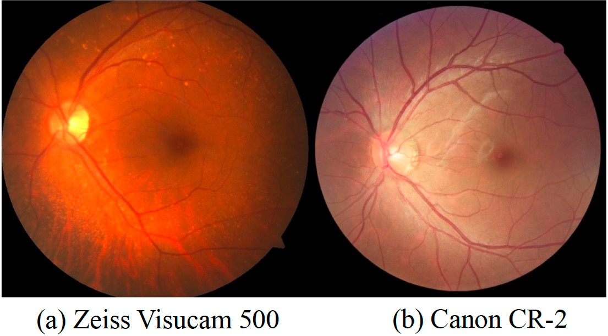
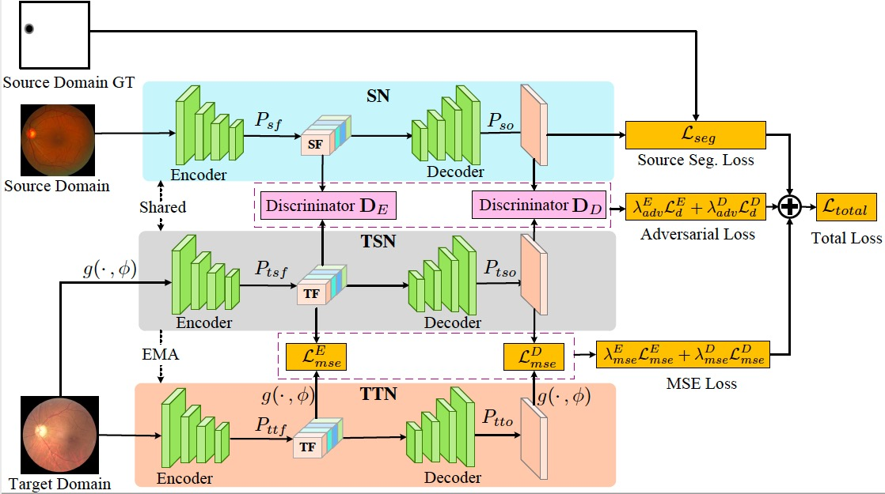
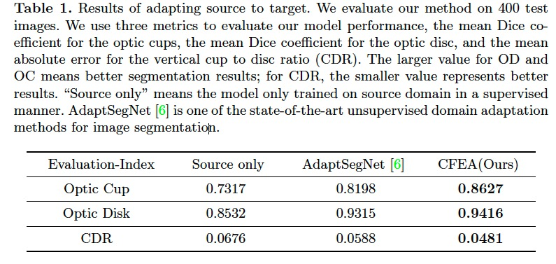
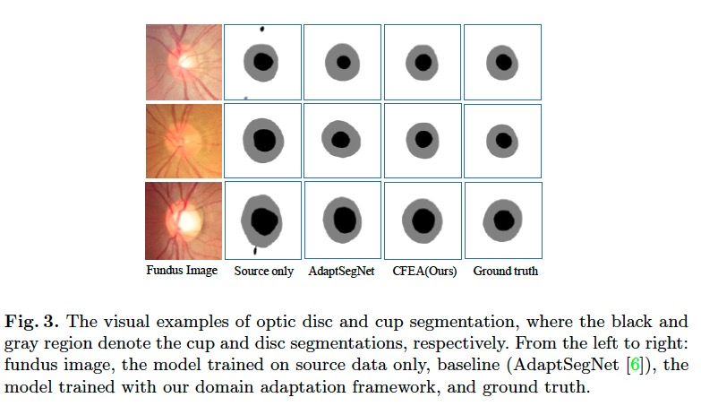

# CFEA: Collaborative Feature Ensembling Adaptation for Domain Adaptation in Unsupervised Optic Disc and Cup Segmentation

### Paper versions

[**MICCAI 2019 version**](https://arxiv.org/pdf/1908.06912.pdf)

### Pytorch implementation of CFEA.

This is a Pytorch implementation of the paper "CFEA: Collaborative Feature Ensembling Adaptation for Domain Adaptation in Unsupervised Optic Disc and Cup Segmentation". 

### Requirements

* python 3.6
* pytoch 1.0.0
* albumentations

## 1. Abstract

Recently, deep neural networks have demonstrated compara-
ble and even better performance with board-certied ophthalmologists in
well-annotated datasets. However, the diversity of retinal imaging devices
poses a signicant challenge: domain shift, which leads to performance
degradation when applying the deep learning models to new testing do-
mains. In this paper, we propose a novel unsupervised domain adap-
tation framework, called Collaborative Feature Ensembling Adaptation
(CFEA), to effectively overcome this challenge. Our proposed CFEA
is an interactive paradigm which presents an exquisite of collaborative
adaptation through both adversarial learning and ensembling weights. In
particular, we simultaneously achieve domain-invariance and maintain an
exponential moving average of the historical predictions, which achieves
a better prediction for the unlabeled data, via ensembling weights dur-
ing training. Without annotating any sample from the target domain,
multiple adversarial losses in encoder and decoder layers guide the ex-
traction of domain-invariant features to confuse the domain classier and
meanwhile benet the ensembling of smoothing weights. Comprehensive
experimental results demonstrate that our CFEA model can overcome
performance degradation and outperform the state-of-the-art methods
in segmenting retinal optic disc and cup from fundus images.

## 2. Domain shift 



## 3. Network Structure


 
## 4. Training and testing
### 1.  Get the data from https://refuge.grand-challenge.org and go to src/data_preprocess/generate_ROI.py 

### 2. Train the model:
 
   ```shell
   cd src
   python train.py
   ```
### 3. Predict the masks:

   ```shell
   python predict.py
   ```
## 5. Unsupervised Segmentation Results

### 1. Results of adapting source to target

 
 
### 2. The visual examples of optic disc and cup segmentation


## 6. Citation
```
@inproceedings{liu2019cfea,
  title={CFEA: Collaborative Feature Ensembling Adaptation for Domain Adaptation in Unsupervised Optic Disc and Cup Segmentation},
  author={Liu, Peng and Kong, Bin and Li, Zhongyu and Zhang, Shaoting and Fang, Ruogu},
  booktitle={International Conference on Medical Image Computing and Computer-Assisted Intervention},
  pages={521--529},
  year={2019},
  organization={Springer}
}
```
### Questions

Further questions, please feel free to contact `pliu1 at ufl.edu` or `bkong at uncc.edu`
